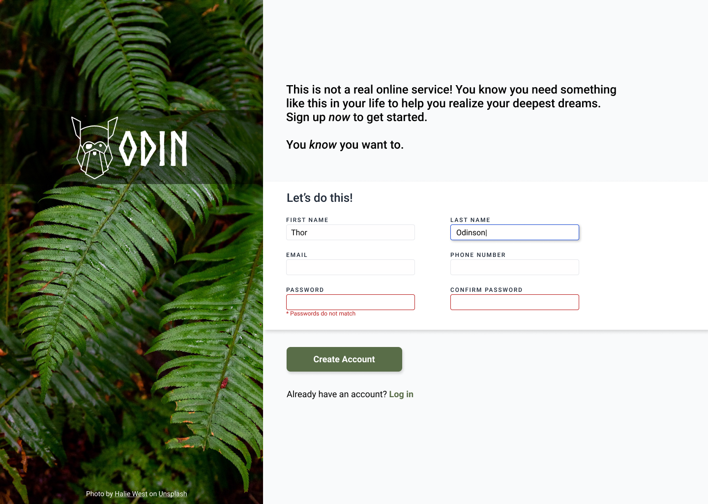

# Sign-Up Form

This project is a part of The Odin Project curriculum. The goal is to create a sign-up form for an imaginary service.
You can look at the result by clicking on this [link](https://shalakushka.github.io/sign-up-form).

## Project Overview

This web page is designed to be a sign-up form that will be submitted to [httpbin](https://httpbin.org/). The form includes various input fields such as username, email, password, and password confirmation. The layout and styling are based on a reference design provided in the project instructions.

## Reference

## Credits

- Background image: [Halie West](https://unsplash.com/photos/green-leaf-plant-in-close-up-photography-25xggax4bSA)
- Logo font: [Norse Bold](https://www.dafont.com/norse.font)
